# Typical Ideas Mod

  

This is an archive for a discontinued 2015 mod for classic Serious Sam: The Second Encounter v1.07 that adds a lot of gameplay options for customizing multiplayer games.

Unfortunately, the source code for this mod has been lost to time but the later [Advanced Multiplayer](https://github.com/DreamyCecil/AdvancedMultiplayer) mod has evolved from this exact mod and almost all of its features can be found in it.

# Screenshots

Multiplayer options

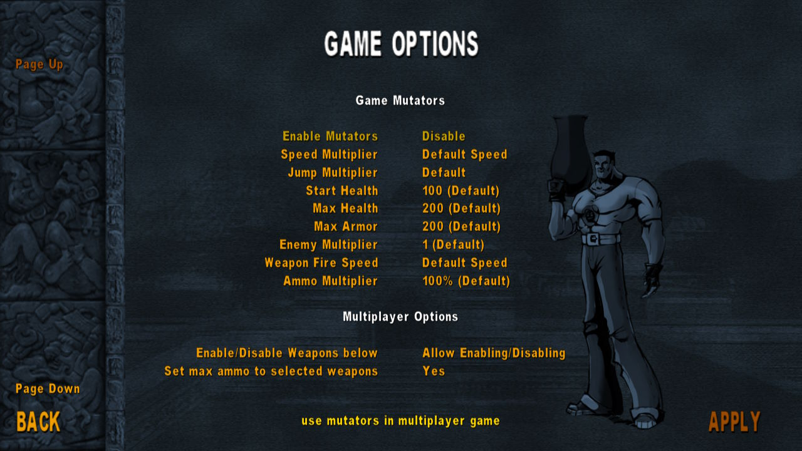
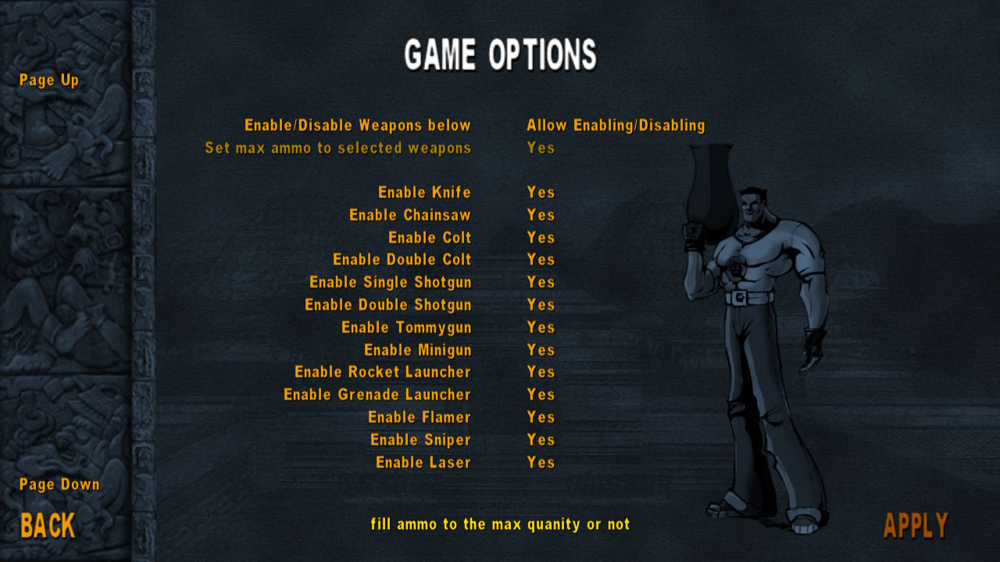
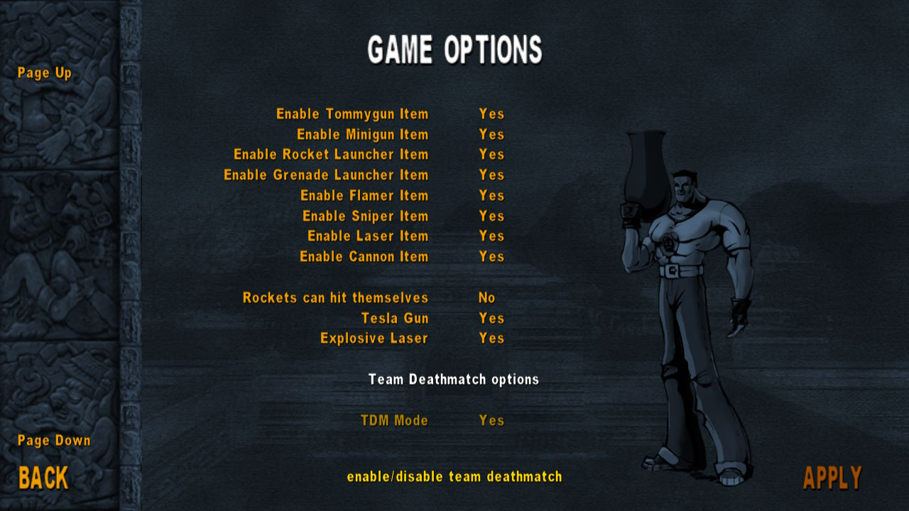

Team Deathmatch mode

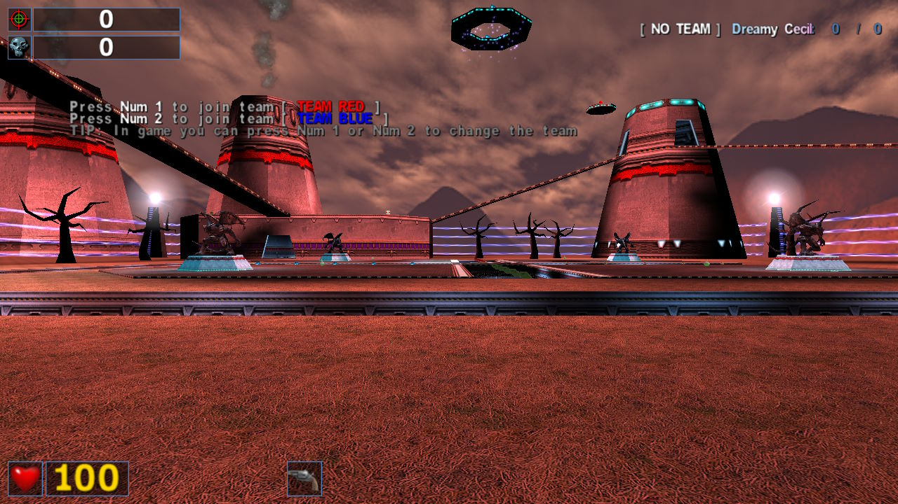
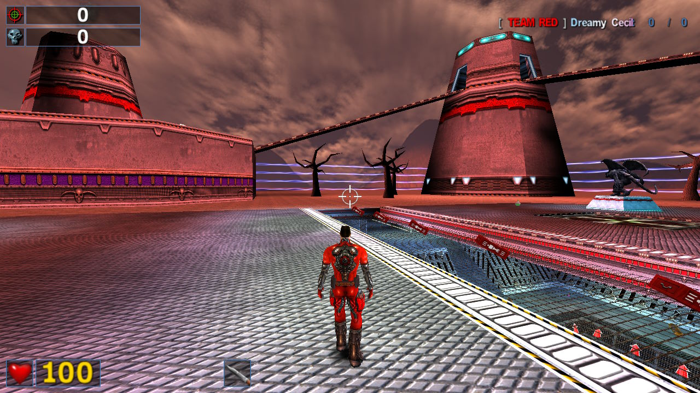
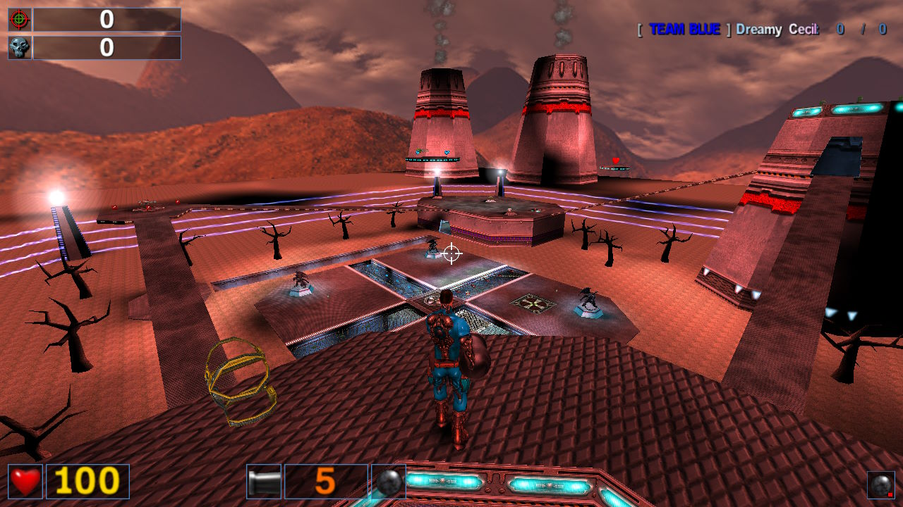

Map voting system

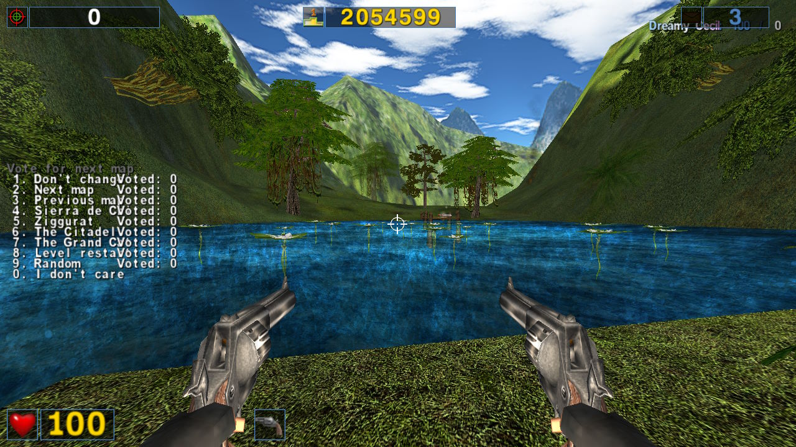
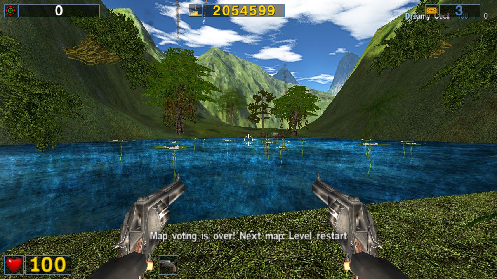
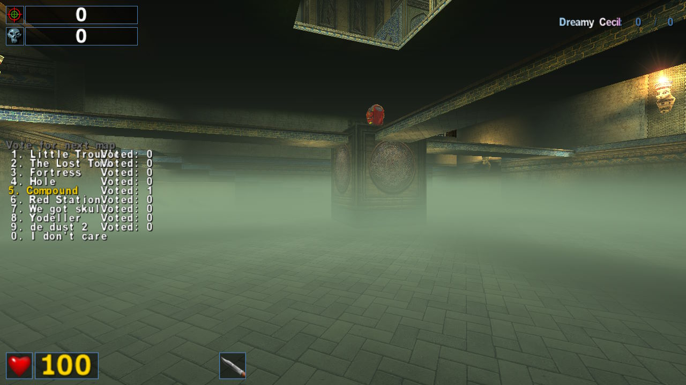

Gameplay

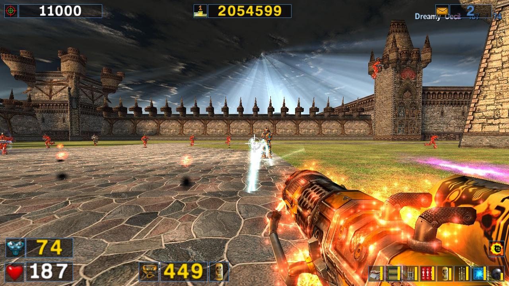
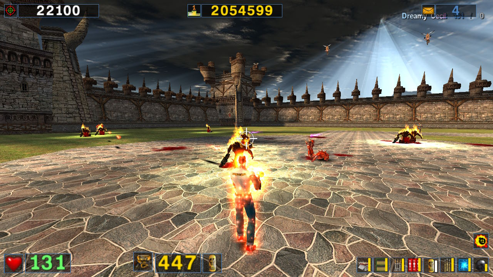

# License

Typical Ideas is licensed under the GNU GPL v2 (see LICENSE file).

Despite not having any source code, I'm still licensing it as such in order to be compatible with [Serious Engine 1.10](https://github.com/Croteam-official/Serious-Engine/) in case you decide to link against it or try decompiling it in any way.
